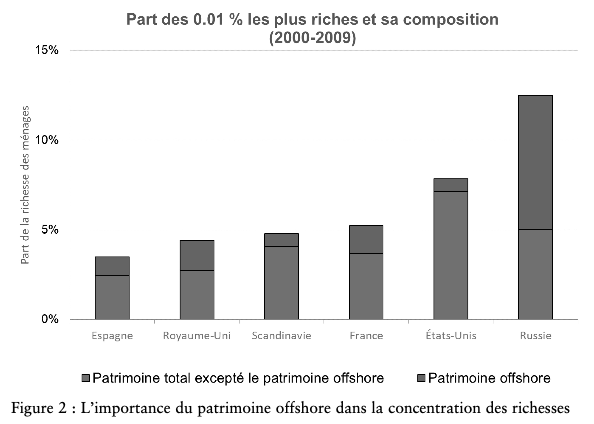

---

##### Chapter in Book

+ [Book](https://www.puf.com/leurope-du-marche-la-puissance-publique)

---

##### Abstract

À partir de l’exemple de l’application des sanctions financières contre les oligarques russes, nous plaidons en faveur de la mise en place d’un registre européen des actifs qui permettrait de recenser les propriétaires de l’ensemble des différents actifs, notamment financiers ou immobiliers, détenus en Europe. La Russie est le pays d’Europe où l’inégalité des richesses est la plus forte, et les ressortissants russes les plus riches dissimulent une grande partie de leur fortune dans des paradis fiscaux. L’architecture actuelle du système financier mondial empêche d’avoir une connaissance complète de la pro- priété effective de tous les types d’actifs et de toutes les juridictions. Les informations déjà existantes sur la pro- priété de ces actifs, actuellement dispersées, pourraient être rassemblées au niveau européen. Cela changerait la donne et permettrait de mieux cibler les sanctions et de disposer d’outils efficaces pour lutter contre le blanchi- ment d’argent, la corruption et l’évasion fiscale. L’Union européenne pourrait ainsi jouer un rôle de pionnier en franchissant la prochaine étape vers une plus grande transparence financière.

---

##### Figure

---

##### Related material

+ [Initial Note in English](EAR.pdf)

