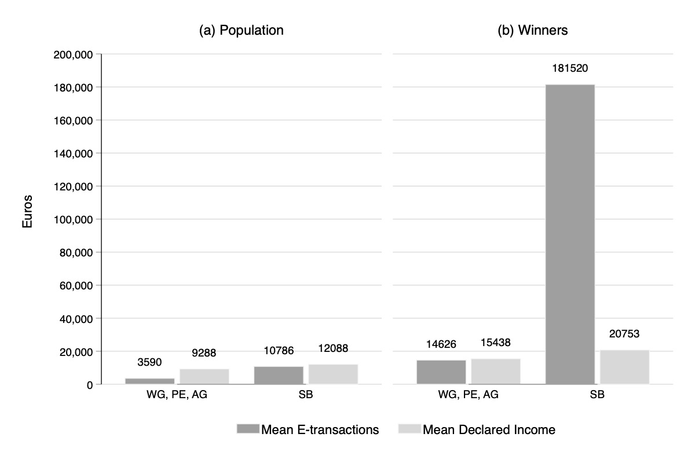

---

##### Download

+ [Paper](dividend.pdf)
# [Online appendix](appendix2.pdf)
# [Code and data](https://github.com/pmichaillat/wunk)

---

##### Abstract

This paper studies the determinants and responses of winners in the Greek tax lottery. The scheme incentivises consumers to switch from cash to electronic payments, thereby generating third-party information that can increase tax compliance. Tickets map directly to electronic consumption, with 1,000 winners awarded e 1,000 every month. Using administrative tax and consumption data, I reconstruct a representative taxpayer population to examine the characteristics of winners. High-income/high-consumption taxpayers win more frequently: A 10% income increase is associated with a 0.11% increase in winning probability. The self-employed record particularly large amounts of transactions, increasing their winning probability by 0.18% compared to other income categories Utilising a unique event of retroactive draws in Christmas 2017, I document heterogeneity in the winners’ responses in electronic consumption along the income and occupation dimensions. Counter to the scheme’s design that links higher winning probabilities to higher spending, I provide evidence of (a) temporary increases in electronic consumption for taxpayers in low-to-middle income quantiles and, non-responsiveness for the highest income taxpayers (b) temporary increases for wage-earners and pensioners and, a non-responsiveness for the self-employed. These results have fairness and efficacy implications, which can be mitigated through a ticket ceiling that limits the winning probabilities for high consumption individuals

---

##### Figure

---
