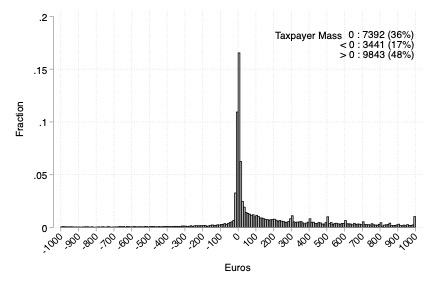

---

##### Download

+ [Paper](ECTD.pdf)

---

##### Abstract

How effective are features of the income tax in incentivising a change in behaviour? I studyhow Greek taxpayers respond to a novel policy, which conditions their personal tax allowance on electronic consumption, requiring specific amounts to be reached during the financial year. Aimed at incentivising a change from cash to electronic payments, the policy includes almost all taxpayers by default, generates monthly electronic spending information and pre-fills the annual amounts spent in tax returns. Using a unique administrative dataset of 50,000 randomly-drawn taxpayers, I document (a) strong responses to the policy during tax filing, with 92% reporting the required amounts to gain the full tax discount, (b) evidence of increased reported amounts if consumption is lower than required, (c) economically and statistically significant electronic consumption responses in some taxpayers as the end-of-year deadline approaches. Adjustment costs in the form of policy inattention, liquidity constraints and low perceived costs of audit can explain the mixed policy outcome. The results suggest that linking incentives to existing features of the income tax system can trigger large responses, but the overall effect depends on adjustment costs in the taxpayer population.

---

##### Figure

---

##### Related Material

+ [Code](https://github.com/panosni/ECTD)