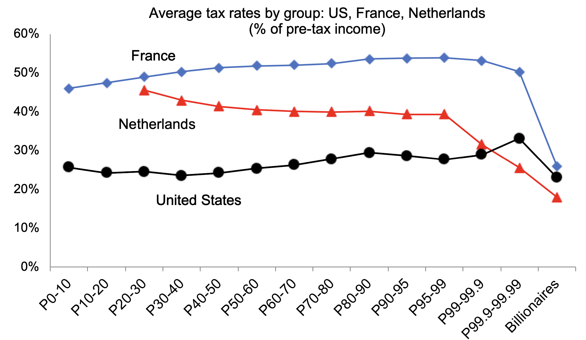

---

##### Download

+ [Paper](report2024.pdf)

---

##### Abstract

Over the last 10 years, governments have launched major initiatives to reduce international tax evasion. Yet despite the importance of these developments, little is known about the effects of these new policies. Is global tax evasion falling or rising? Are new issues emerging, and if so, what are they? This report addresses these questions thanks to an unprecedented international research collaboration building on the work of more than 100 researchers globally.

---

##### Figure

---

##### Related Material

+ [Figures and Online Appendix](https://www.taxobservatory.eu/publication/global-tax-evasion-report-2024/)